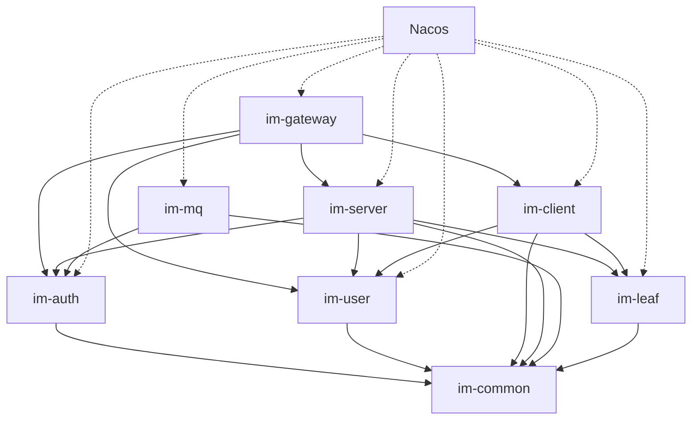

# IM即时通讯系统

<div align="center">
  <h3>🚀 基于微服务架构的分布式即时通讯系统</h3>
  <p>致力于打造一个保证消息可靠、安全、有序的即时通讯解决方案</p>
</div>

## 📖 项目概述

IM即时通讯系统是一个基于现代微服务架构的分布式即时通讯解决方案，采用Spring Boot 3.x + Spring Cloud技术栈构建。系统专注于解决即时通讯领域的三大核心挑战：**消息可靠性**、**系统安全性**和**消息有序性**。

### 🎯 核心价值

- **高可靠性**：通过ACK确认机制和消息重发策略，确保消息零丢失
- **强安全性**：基于JWT认证和DH密钥交换算法，保障通信安全
- **严格有序**：采用分布式ID生成和消息队列技术，维护消息时序
- **高可扩展**：微服务架构设计，支持水平扩展和独立部署
- **高性能**：基于Netty的异步网络通信，支持大并发连接

### 🌟 主要特点

- **分布式架构**：8个独立微服务，职责清晰，便于维护和扩展
- **多协议支持**：支持WebSocket和TCP长连接，适应不同客户端需求
- **消息加密**：端到端加密保护，确保通信内容安全
- **实时推送**：基于Kafka的消息推送机制，保证消息实时到达
- **OAuth2集成**：支持第三方登录（Gitee），提升用户体验
- **监控完善**：集成日志记录和性能监控，便于运维管理

### 🎪 应用场景

- **企业内部通讯**：支持部门间协作和项目沟通
- **客服系统**：提供实时客户服务和技术支持
- **社交应用**：构建安全可靠的社交通讯平台
- **游戏聊天**：为游戏应用提供聊天功能支持
- **IoT通讯**：支持物联网设备间的消息传递

## 🛠️ 技术栈

### 核心框架
- **Spring Boot** `3.1.5` - 微服务基础框架
- **Spring Cloud** `2022.0.4` - 微服务治理框架
- **Spring Cloud Alibaba** `2022.0.0.0` - 阿里巴巴微服务组件

### 服务治理
- **Nacos** `2.2.1` - 服务注册发现与配置管理
- **Spring Cloud Gateway** - API网关与路由
- **OpenFeign** - 服务间调用

### 数据存储
- **MySQL** - 主数据库，存储用户信息、消息记录
- **Redis** - 缓存数据库，存储会话、token等
- **MyBatis-Plus** `3.5.4.1` - 数据访问层框架

### 消息队列
- **RabbitMQ** - 消息可靠性保证、延迟队列
- **Kafka** - 消息推送、实时数据流处理

### 网络通信
- **Netty** - 高性能异步网络通信框架
- **Protocol Buffers** - 高效的序列化协议

### 安全认证
- **Spring Security** - 安全框架
- **JWT** - 无状态认证token
- **OAuth2** - 第三方登录支持
- **DH密钥交换** - 端到端加密

### 工具库
- **Hutool** `5.8.23` - Java工具类库
- **Lombok** `1.18.24` - 代码简化工具

## 🏗️ 系统架构

### 微服务架构图

```
                    ┌─────────────────┐
                    │   API Gateway   │
                    │    (8088)       │
                    └─────────┬───────┘
                              │
              ┌───────────────┼───────────────┐
              │               │               │
    ┌─────────▼─────────┐ ┌───▼────┐ ┌───────▼────────┐
    │   Auth Service    │ │  User  │ │  Message       │
    │     (20007)       │ │Service │ │  Client        │
    └───────────────────┘ │(20000) │ │   (20002)      │
                          └────────┘ └────────────────┘
              │               │               │
    ┌─────────▼─────────┐ ┌───▼────┐ ┌───────▼────────┐
    │  Message Server   │ │   MQ   │ │  ID Generator  │
    │     (20001)       │ │Service │ │   (20090)      │
    └───────────────────┘ │(20005) │ └────────────────┘
                          └────────┘
```

### 服务职责说明

| 服务名称 | 端口 | 主要职责 |
|---------|------|----------|
| **im-gateway** | 8088 | API网关，统一入口，路由转发，权限验证 |
| **im-auth** | 20007 | 用户认证，token管理，OAuth2集成 |
| **im-user** | 20000 | 用户管理，好友关系，权限控制 |
| **im-server** | 20001 | 消息服务端，Netty服务，消息处理 |
| **im-client** | 20002 | 消息客户端，连接管理，消息推送 |
| **im-mq** | 20005 | 消息队列服务，可靠性保证，异步处理 |
| **im-leaf** | 20090 | 分布式ID生成，雪花算法，全局唯一 |
| **im-common** | - | 通用组件，工具类，数据模型 |

### 消息可靠性保证机制

系统采用多层次的消息可靠性保证策略，确保消息在复杂网络环境下的零丢失：

#### 1. ACK确认机制
- **发送确认**：消息发送后等待接收方ACK确认
- **超时检测**：设置合理的ACK超时时间
- **状态追踪**：实时跟踪消息传递状态

#### 2. 消息重发策略
```
发送消息 → 存储到Redis → 放入延迟队列 → 等待ACK
    ↓                                        ↑
收到ACK → 删除Redis缓存                      │
    ↓                                        │
超时未收到ACK → 检查重发次数 → 重新发送 ──────┘
    ↓
达到重发上限 → 标记失败 → 异常处理
```

#### 3. 分布式事务保证
- **本地消息表**：确保消息发送与业务操作的一致性
- **最终一致性**：通过补偿机制保证数据最终一致
- **幂等性设计**：支持消息重复处理而不影响业务逻辑

#### 4. 存储双写机制
- **MySQL持久化**：消息永久存储，支持历史查询
- **Redis缓存**：热点数据快速访问，提升性能
- **数据同步**：通过Canal实现MySQL到Redis的实时同步

## 📨 消息处理流程

### 私聊消息流程

私聊消息的处理涉及多个服务组件的协调工作，整个流程确保消息的可靠传递和状态追踪：

#### 消息发送阶段
1. **客户端发起**：发送方客户端通过WebSocket长连接向消息服务端发送私聊消息，消息包含发送方ID、接收方ID、消息内容、消息类型等基本信息。

2. **网关处理**：API网关接收到请求后，首先进行JWT token验证，确认用户身份的合法性，然后检查用户是否具有发送消息的权限。

3. **服务路由**：网关根据路由规则将请求转发到对应的消息服务端实例，实现负载均衡和服务分发。

#### 消息验证与存储阶段
4. **好友关系验证**：消息服务端通过Feign调用用户服务，验证发送方和接收方是否存在好友关系，只有好友之间才能发送私聊消息。

5. **消息加密处理**：使用DH密钥交换算法生成的共享密钥对消息内容进行加密，确保消息在传输和存储过程中的安全性。

6. **数据库持久化**：将加密后的消息信息存储到MySQL数据库中，包括消息ID、发送方ID、接收方ID、消息内容、发送时间、消息状态等字段。

7. **发送方ACK确认**：向发送方客户端返回消息发送成功的ACK确认，告知消息已成功接收并处理。

#### 消息推送阶段
8. **队列投递**：将消息信息封装后投递到Kafka消息队列中，利用Kafka的高吞吐量特性实现异步消息处理。

9. **推送缓存存储**：在Redis中存储待推送消息的详细信息，包括消息唯一ID、重发次数、超时时间等，用于后续的ACK确认和重发机制。

10. **接收方推送**：消息队列服务从Kafka中消费消息，通过会话管理器查找接收方的连接信息，将消息推送到接收方客户端。

#### 确认与清理阶段
11. **接收方ACK**：接收方客户端收到消息后，向消息服务端发送ACK确认，表示消息已成功接收。

12. **缓存清理**：消息服务端收到接收方的ACK确认后，从Redis中删除对应的待推送消息缓存，完成整个消息传递流程。

13. **超时重发**：如果在指定时间内未收到接收方的ACK确认，系统会触发消息重发机制，确保消息的可靠传递。

### 群聊消息流程

群聊消息的处理相比私聊更加复杂，需要处理多个接收方的消息分发和状态管理：

#### 消息接收与验证阶段
1. **群消息发送**：发送方客户端通过WebSocket连接向消息服务端发送群聊消息，消息中包含群组ID、发送方ID、消息内容等信息。

2. **群成员身份验证**：消息服务端首先验证发送方是否为该群组的有效成员，通过查询群成员关系表确认发送权限。

3. **消息解密与处理**：使用发送方与群组之间的共享密钥对消息内容进行解密，获取原始消息内容用于后续处理。

#### 消息存储与确认阶段
4. **群消息入库**：将解密后的群消息信息存储到专门的群消息表中，记录群组ID、发送方ID、消息内容、发送时间等详细信息。

5. **发送方ACK确认**：向发送方客户端返回消息发送成功的ACK确认，表示群消息已被服务端成功接收和处理。

#### 成员查询与消息分发阶段
6. **在线成员查询**：从Redis缓存中查询当前在该群组中的所有在线成员列表，这个列表实时维护着群成员的在线状态。

7. **消息加密与封装**：为每个在线群成员生成对应的加密消息，使用群组公钥和成员私钥进行端到端加密处理。

8. **批量队列投递**：将针对所有在线群成员的消息批量投递到Kafka消息队列中，每个成员对应一条独立的推送消息。

#### 并行推送与确认阶段
9. **并行消息推送**：消息队列服务并行处理所有群成员的消息推送任务，通过会话管理器找到每个在线成员的连接通道，同时向所有在线成员推送消息。

10. **推送状态缓存**：在Redis中为每个群成员创建独立的推送状态缓存，记录消息推送状态、重发次数、超时时间等信息。

11. **成员ACK收集**：各个群成员客户端收到消息后，分别向消息服务端发送ACK确认，服务端收集并记录每个成员的确认状态。

#### 状态管理与清理阶段
12. **ACK状态聚合**：消息服务端维护群消息的整体确认状态，跟踪哪些成员已确认、哪些成员需要重发、哪些成员离线等状态信息。

13. **离线消息处理**：对于离线的群成员，系统会将消息标记为待推送状态，等待成员上线后进行消息补发。

14. **缓存清理与统计**：当所有在线成员都确认接收后，清理Redis中的相关推送缓存，并更新群消息的传递统计信息。

#### 群聊特殊机制
- **成员权限控制**：支持群管理员设置发言权限，控制特定成员的消息发送能力
- **消息广播优化**：采用扇出模式实现高效的消息广播，减少服务端处理压力
- **在线状态同步**：实时维护群成员在线状态，确保消息推送的准确性
- **消息去重机制**：防止群成员收到重复消息，保证消息传递的唯一性

## 🛡️ 消息可靠性、有序性与安全性保证

### 消息可靠性保证机制

#### ACK确认机制的工作原理

系统采用双向ACK确认机制确保消息的可靠传递。当发送方发送消息后，系统会在多个层面进行确认：

**发送方ACK确认**：消息服务端接收到消息并完成初步处理后，立即向发送方返回ACK确认，告知消息已被系统接收。这个确认包含消息的唯一ID和处理状态，让发送方知道消息已进入系统处理流程。

**接收方ACK确认**：当消息成功推送到接收方客户端后，接收方需要向服务端发送ACK确认，表示消息已被成功接收和处理。这个确认机制确保消息真正到达了目标用户。

**ACK超时检测**：系统为每个待确认的消息设置超时时间，如果在规定时间内未收到相应的ACK确认，系统会触发相应的处理机制，如消息重发或异常告警。

#### 消息重发策略

**重发触发条件**：系统通过RabbitMQ的延迟队列机制实现消息重发。当消息发送后，系统会将消息的唯一ID和当前重发次数放入延迟队列中。如果在ACK超时时间内未收到确认，延迟队列中的消息会被投递到死信队列进行处理。

**重发次数限制**：系统设置了最大重发次数限制（通常为3-5次），防止无限重发造成系统资源浪费。每次重发时，系统会递增重发次数计数器，当达到最大重发次数时，系统会将消息标记为发送失败并触发异常处理流程。

**超时处理策略**：重发间隔采用指数退避算法，第一次重发间隔较短（如30秒），后续重发间隔逐渐增长（如60秒、120秒），这样既能快速处理临时网络问题，又能避免对系统造成过大压力。

**重发优先级管理**：系统对不同类型的消息设置不同的重发优先级，重要的系统消息具有更高的重发优先级和更多的重发次数，而普通聊天消息则采用标准的重发策略。

#### 本地消息表与分布式事务

**本地消息表机制**：每个微服务都维护自己的本地消息表，记录需要发送的消息和消息状态。当业务操作和消息发送需要保持一致性时，系统会在同一个本地事务中完成业务数据更新和消息表记录插入。

**分布式事务协调**：系统采用最终一致性模式处理分布式事务。通过定时任务扫描本地消息表中未发送成功的消息，重新尝试发送，确保消息最终能够被成功处理。

**幂等性保证**：所有消息处理接口都设计为幂等操作，即使消息被重复处理也不会影响业务逻辑的正确性。系统通过消息唯一ID进行去重，确保同一条消息不会被重复执行。

**事务补偿机制**：当分布式事务中的某个环节失败时，系统会触发补偿操作，回滚已执行的操作或进行数据修复，保证系统数据的一致性。

#### Redis缓存的作用与数据同步

**消息状态缓存**：Redis存储消息的实时状态信息，包括消息发送状态、ACK确认状态、重发次数等。这些信息需要快速访问和更新，Redis的高性能特性非常适合这种场景。

**会话信息缓存**：用户的在线状态、连接信息、会话数据等都缓存在Redis中，支持快速的消息路由和推送决策。

**消息队列缓存**：待推送的消息详情临时存储在Redis中，包括消息内容、目标用户、推送时间等信息，便于消息推送服务快速获取和处理。

**数据同步策略**：系统通过Canal监听MySQL的binlog变化，实时将重要数据同步到Redis中。同时采用双写策略，在更新MySQL的同时更新Redis缓存，确保数据的一致性和实时性。

### 消息有序性保证机制

#### 分布式ID生成策略

**雪花算法实现**：系统采用改进的雪花算法生成全局唯一的消息ID。算法结构包含时间戳（41位）、机器标识（10位）和序列号（12位），确保在分布式环境下生成的ID具有全局唯一性和时间有序性。

**ID预生成与缓存**：为了提高ID生成的性能，系统实现了ID预生成机制。通过后台线程预先生成一批ID存储在Redis缓存中，当应用需要ID时直接从缓存中获取，避免了实时计算的性能开销。

**机器时钟同步**：系统要求所有服务器节点保持时钟同步，通过NTP服务定期校准系统时间，确保不同节点生成的ID在时间维度上保持正确的顺序关系。

**ID回拨处理**：当检测到系统时钟回拨时，算法会等待时钟追上最后一次生成ID的时间，或者通过调整机器标识位来避免ID冲突，保证ID生成的连续性和唯一性。

#### 时间戳排序与消息队列顺序保证

**消息时间戳管理**：每条消息都包含精确的时间戳信息，包括客户端发送时间、服务端接收时间和处理时间。系统以服务端接收时间为准进行消息排序，避免客户端时间不同步导致的顺序问题。

**队列分区策略**：Kafka消息队列采用基于用户ID或会话ID的分区策略，确保同一个会话的消息被分配到同一个分区中，利用Kafka单分区内消息有序的特性保证消息顺序。

**消息序号机制**：在消息ID的基础上，系统为每个会话维护独立的消息序号，确保同一会话内的消息具有连续递增的序号，便于客户端进行消息排序和去重。

**顺序消费保证**：消息消费者采用单线程顺序消费模式处理同一会话的消息，避免并发处理导致的消息乱序问题。

#### 并发场景下的时序关系维护

**会话级别锁机制**：对于同一个会话的消息处理，系统采用分布式锁机制确保消息的串行处理。通过Redis实现的分布式锁，保证同一时刻只有一个线程能够处理特定会话的消息。

**消息缓冲与排序**：当系统检测到消息可能出现乱序时，会将消息暂存在缓冲区中，根据消息的时间戳和序号进行重新排序，然后按正确顺序进行处理和推送。

**并发控制策略**：系统限制同一用户的并发消息发送数量，通过令牌桶算法控制消息发送频率，既保证了系统性能，又维护了消息的时序关系。

#### 私聊与群聊的有序性处理差异

**私聊消息有序性**：私聊场景下，系统为每对用户维护独立的消息序列，确保A到B的消息和B到A的消息分别保持有序。通过会话ID作为分区键，将同一会话的消息路由到同一个处理节点。

**群聊消息有序性**：群聊场景更加复杂，系统需要保证群内所有成员看到的消息顺序一致。采用群组ID作为分区键，确保同一群组的所有消息在同一个分区中按时间顺序处理。

**消息广播顺序**：群聊消息在广播给多个成员时，系统采用批量处理机制，先将消息按顺序存储，然后并行推送给所有在线成员，保证所有成员收到的消息顺序一致。

**离线消息排序**：对于离线用户，系统会将消息按时间顺序存储在离线消息表中，当用户上线时按正确顺序推送历史消息，保证用户看到完整有序的消息记录。

### 消息安全性保证机制

#### DH密钥交换算法实现与密钥管理

**密钥交换流程**：系统采用Diffie-Hellman密钥交换算法实现端到端加密。当用户注册时，系统为每个用户生成一对公私钥，公钥存储在数据库中供其他用户获取，私钥加密后存储在Redis缓存中。

**共享密钥生成**：当两个用户需要进行私聊时，系统使用DH算法计算出双方的共享密钥。发送方使用接收方的公钥和自己的私钥计算共享密钥，接收方使用发送方的公钥和自己的私钥计算出相同的共享密钥。

**群组密钥管理**：群聊场景下，系统为每个群组生成独立的公私钥对。群组公钥存储在数据库中，私钥加密后存储在服务端Redis中。群成员使用群组公钥和自己的私钥生成与群组的共享密钥。

**密钥轮换机制**：为了提高安全性，系统定期更新用户和群组的密钥对。密钥轮换时，系统会生成新的密钥对，并通过安全通道通知相关用户更新本地密钥，确保通信安全的持续性。

**密钥存储安全**：私钥在存储时使用AES算法进行加密，加密密钥由系统配置管理，并定期更换。同时采用密钥分片存储技术，将完整密钥分成多个片段存储在不同位置。

#### 端到端加密实现方式

**消息加密流程**：发送方在发送消息前，使用与接收方的共享密钥对消息内容进行AES加密。加密后的消息在传输和存储过程中始终保持加密状态，只有拥有对应私钥的接收方才能解密。

**加密算法选择**：系统采用AES-256-GCM加密算法，该算法不仅提供强加密保护，还具有认证功能，能够检测消息是否被篡改。每条消息使用随机生成的初始化向量（IV），确保相同内容的消息产生不同的密文。

**消息完整性验证**：除了加密保护，系统还为每条消息生成HMAC签名，用于验证消息的完整性和真实性。接收方在解密消息后会验证HMAC签名，确保消息未被篡改。

**前向安全性**：系统实现了前向安全机制，即使某个时刻的密钥被泄露，也不会影响之前消息的安全性。通过定期更新会话密钥和使用临时密钥等方式实现前向安全。

#### JWT认证机制与Token管理策略

**JWT结构设计**：系统使用JWT作为用户认证凭证，JWT包含用户ID、权限信息、过期时间等关键信息。JWT使用RS256算法进行签名，确保token的不可伪造性。

**双Token机制**：系统采用Access Token和Refresh Token的双token机制。Access Token用于日常API调用，有效期较短（如2小时）；Refresh Token用于刷新Access Token，有效期较长（如7天）。

**Token安全存储**：Access Token存储在客户端内存中，不持久化到本地存储。Refresh Token加密后存储在客户端的安全存储区域。服务端将token信息存储在Redis中，支持快速验证和撤销。

**Token撤销机制**：系统支持主动撤销token，当用户登出或检测到异常行为时，可以立即撤销相关token。通过Redis黑名单机制实现token的实时撤销。

**多设备管理**：系统支持用户在多个设备上同时登录，为每个设备生成独立的token。用户可以查看和管理所有登录设备，并可以远程撤销特定设备的访问权限。

#### 传输层安全与数据存储加密

**传输加密**：生产环境中，所有HTTP通信都通过HTTPS进行，WebSocket连接使用WSS协议。系统使用TLS 1.3协议，提供强加密和完美前向保密。

**API安全防护**：系统实现了完整的API安全防护机制，包括请求签名验证、时间戳防重放攻击、请求频率限制等。所有敏感API都需要额外的权限验证。

**数据库加密**：敏感数据在存储到数据库前进行加密处理，包括用户密码、私钥信息、敏感消息内容等。使用不同的加密密钥对不同类型的数据进行加密。

**日志安全**：系统日志中不记录任何敏感信息，如密码、密钥、完整的token等。对于必要的调试信息，采用脱敏处理或加密存储。

**网络安全策略**：部署时采用网络隔离策略，数据库和Redis等存储服务不直接暴露在公网上。通过防火墙和安全组规则限制网络访问，只允许必要的服务间通信。

### 故障恢复和容错机制

#### 断线重连机制与会话恢复策略

**智能重连算法**：客户端实现了智能断线重连机制，当检测到网络连接断开时，会立即尝试重新连接。重连采用指数退避算法，初始重连间隔较短，如果连续重连失败，间隔时间会逐渐增长，避免对服务器造成过大压力。

**连接状态监控**：系统通过心跳机制实时监控连接状态。客户端定期向服务端发送心跳包，服务端也会定期检查客户端的活跃状态。当检测到连接异常时，双方都会触发相应的处理流程。

**会话状态保持**：服务端为每个用户维护会话状态信息，包括用户的在线状态、连接信息、未读消息数量等。当用户重新连接时，系统会恢复之前的会话状态，确保用户体验的连续性。

**断点续传机制**：对于文件传输等长时间操作，系统支持断点续传功能。当连接中断时，系统会记录传输进度，重连后可以从中断点继续传输，避免重新开始。

**多连接容错**：系统支持用户在多个设备上同时在线，当某个设备的连接出现问题时，不会影响其他设备的正常使用。服务端会智能选择最佳的连接进行消息推送。

#### 消息补发功能与数据一致性检查

**离线消息管理**：当用户离线时，系统会将发送给该用户的消息存储在离线消息表中。用户重新上线时，系统会按时间顺序推送所有离线消息，确保用户不会遗漏任何消息。

**消息同步机制**：客户端会定期与服务端进行消息同步，比较本地消息记录与服务端记录的差异。如果发现缺失消息，会主动请求服务端补发相关消息。

**数据一致性校验**：系统定期进行数据一致性检查，比较不同存储系统中的数据是否一致。包括MySQL与Redis之间的数据一致性，以及不同服务节点之间的数据一致性。

**消息去重处理**：在消息补发过程中，系统会进行严格的去重处理，通过消息唯一ID确保同一条消息不会被重复推送给用户。

**增量同步优化**：为了提高同步效率，系统采用增量同步机制，只同步用户上次同步时间点之后的新消息，减少网络传输和处理开销。

#### 系统异常情况下的降级处理方案

**服务降级策略**：当系统负载过高或某些服务出现故障时，系统会自动启动降级策略。非核心功能会被暂时关闭，优先保证核心的消息收发功能正常运行。

**熔断器机制**：系统集成了熔断器模式，当某个服务的错误率超过阈值时，会自动熔断对该服务的调用，避免故障扩散。熔断器会定期尝试恢复，当服务恢复正常时自动恢复调用。

**限流保护**：系统实现了多层次的限流保护，包括用户级别限流、API级别限流和系统级别限流。当请求量超过系统承载能力时，会拒绝部分请求，保护系统稳定运行。

**故障转移机制**：关键服务都部署了多个实例，当某个实例出现故障时，负载均衡器会自动将流量转移到健康的实例上。数据库和缓存也采用主从架构，支持自动故障转移。

**优雅降级处理**：在降级过程中，系统会向用户提供友好的提示信息，说明当前系统状态和预计恢复时间。对于无法立即处理的请求，系统会进行排队处理，而不是直接拒绝。

**监控告警体系**：系统建立了完善的监控告警体系，实时监控各项系统指标。当发现异常时，会立即触发告警通知运维人员，并自动执行预设的应急处理流程。

**数据备份恢复**：系统定期进行数据备份，包括数据库备份、配置文件备份等。当发生严重故障时，可以快速从备份中恢复数据，最大程度减少数据丢失。

### 🔐 用户认证与授权

- **多种登录方式**
  - 用户名密码登录
  - OAuth2第三方登录（Gitee）
  - JWT无状态认证

- **权限管理**
  - 基于角色的访问控制（RBAC）
  - 细粒度权限验证
  - API接口权限控制

- **Token管理**
  - Access Token + Refresh Token双token机制
  - Token自动刷新和过期处理
  - 多设备登录支持

### 💬 即时通讯功能

#### 私聊功能
- **好友管理**：添加好友、删除好友、好友列表
- **消息类型**：文本、图片、文件、语音、视频
- **消息状态**：已发送、已送达、已读
- **消息加密**：基于DH密钥交换的端到端加密
- **离线消息**：支持离线消息存储和推送

#### 群聊功能
- **群组管理**：创建群组、解散群组、群信息修改
- **成员管理**：邀请成员、移除成员、权限设置
- **群消息**：支持群内广播消息
- **群加密**：群级别的消息加密保护
- **在线状态**：实时显示群成员在线状态

### 🛡️ 消息可靠性

- **零丢失保证**
  - ACK确认机制
  - 消息重发策略
  - 本地消息表
  - 分布式事务支持

- **消息有序性**
  - 全局唯一ID生成
  - 时间戳排序
  - 消息队列顺序保证

- **故障恢复**
  - 断线重连机制
  - 消息补发功能
  - 数据一致性检查

### 🚀 高性能特性

- **连接管理**
  - Netty异步网络通信
  - 连接池管理
  - 心跳检测机制
  - 自动重连功能

- **消息推送**
  - Kafka高吞吐量消息队列
  - 异步消息处理
  - 批量消息推送
  - 智能路由策略

- **缓存优化**
  - Redis多级缓存
  - 热点数据预加载
  - 缓存穿透防护
  - 分布式锁机制

### 🔧 系统管理

- **监控告警**
  - 系统性能监控
  - 业务指标统计
  - 异常告警通知
  - 日志分析

- **运维支持**
  - 服务健康检查
  - 配置热更新
  - 灰度发布支持
  - 数据备份恢复

## 📁 项目结构

```
im-chat/
├── docs/                           # 项目文档
│   └── memory_bank.md             # 项目记忆库
├── im-auth/                       # 认证服务 (20007)
│   ├── src/main/java/com/vanky/chat/auth/
│   │   ├── controller/            # 认证控制器
│   │   ├── service/               # 认证业务逻辑
│   │   ├── manager/               # Token管理器
│   │   └── config/                # 安全配置
│   └── src/main/resources/
│       ├── bootstrap.yml          # Nacos配置
│       └── application-dev.yml    # 开发环境配置
├── im-client/                     # 消息客户端 (20002)
│   ├── src/main/java/com/vanky/chat/client/
│   │   ├── netty/                 # Netty客户端
│   │   ├── processor/             # 消息处理器
│   │   └── service/               # 客户端服务
│   └── src/main/resources/
├── im-common/                     # 通用组件
│   ├── src/main/java/com/vanky/chat/common/
│   │   ├── bo/                    # 业务对象
│   │   ├── vo/                    # 视图对象
│   │   ├── to/                    # 传输对象
│   │   ├── utils/                 # 工具类
│   │   ├── exception/             # 异常定义
│   │   ├── feign/                 # Feign客户端
│   │   ├── cache/                 # 缓存常量
│   │   └── response/              # 响应封装
├── im-gateway/                    # API网关 (8088)
│   ├── src/main/java/com/vanky/chat/gateway/
│   │   ├── filter/                # 网关过滤器
│   │   ├── config/                # 网关配置
│   │   └── handler/               # 异常处理器
│   └── src/main/resources/
│       └── application-dev.yml    # 路由配置
├── im-leaf/                       # 分布式ID生成 (20090)
│   ├── src/main/java/com/vanky/chat/leaf/
│   │   ├── controller/            # ID生成接口
│   │   ├── utils/                 # 雪花算法实现
│   │   └── config/                # ID生成配置
├── im-mq/                         # 消息队列服务 (20005)
│   ├── src/main/java/com/vanky/chat/mq/
│   │   ├── service/               # 队列消费者
│   │   ├── config/                # 队列配置
│   │   └── listener/              # 消息监听器
├── im-server/                     # 消息服务端 (20001)
│   ├── src/main/java/com/vanky/chat/server/
│   │   ├── netty/                 # Netty服务端
│   │   ├── processor/             # 消息处理器
│   │   ├── service/               # 业务服务
│   │   ├── mapper/                # 数据访问层
│   │   ├── pojo/                  # 数据模型
│   │   ├── session/               # 会话管理
│   │   ├── push/                  # 消息推送
│   │   └── utils/                 # 服务端工具
├── im-user/                       # 用户管理服务 (20000)
│   ├── src/main/java/com/vanky/chat/user/
│   │   ├── controller/            # 用户接口
│   │   ├── service/               # 用户服务
│   │   ├── mapper/                # 数据访问
│   │   └── pojo/                  # 用户模型
└── pom.xml                        # Maven父项目配置
```

### 模块依赖关系



### 核心模块说明

| 模块 | 核心类 | 主要功能 |
|------|--------|----------|
| **im-auth** | `TokenManager`, `AuthService` | JWT生成验证、OAuth2集成、权限管理 |
| **im-user** | `ImUserService`, `RelationService` | 用户CRUD、好友关系、权限分配 |
| **im-server** | `NettyServer`, `MessageProcessor` | Netty服务、消息路由、会话管理 |
| **im-client** | `NettyClient`, `PushWorker` | 连接管理、消息推送、状态同步 |
| **im-mq** | `WaitMsgAckService`, `ExchangeConfig` | 消息队列、ACK处理、延迟队列 |
| **im-leaf** | `SnowflakeIdWorker`, `CachedIdUtil` | 雪花算法、ID缓存、分布式ID |
| **im-gateway** | `ImGlobalFilter`, `RouteConfig` | 请求路由、权限验证、负载均衡 |
| **im-common** | `RedisUtil`, `Result`, `FeignClient` | 工具类、响应封装、服务调用 |

## 🚀 快速开始

### 环境要求

| 组件 | 版本要求 | 说明 |
|------|----------|------|
| **JDK** | 17+ | 支持Java 17及以上版本 |
| **Maven** | 3.6+ | 项目构建工具 |
| **MySQL** | 8.0+ | 主数据库 |
| **Redis** | 6.0+ | 缓存数据库 |
| **RabbitMQ** | 3.8+ | 消息队列 |
| **Kafka** | 2.8+ | 消息流处理 |
| **Nacos** | 2.2+ | 服务注册与配置中心 |


### 开发模式

使用IDE开发时，可以直接运行各个模块的主类：
- `im.auth.AuthApplication`
- `im.user.UserApplication`
- `im.server.ServerApplication`
- `im.client.ClientApplication`
- `im.mq.MqApplication`
- `im.leaf.LeafApplication`
- `im.gateway.GatewayApplication`


#### 消息格式
```json
{
  "uniqueId": 123456789,
  "fromUserId": 1001,
  "toUserId": 1002,
  "chatType": 1,
  "msgType": 1,
  "content": "消息内容",
  "createTime": 1640995200000
}
```

### 响应状态码

| 状态码 | 说明 |
|--------|------|
| 200 | 请求成功 |
| 400 | 请求参数错误 |
| 401 | 未授权，需要登录 |
| 403 | 权限不足 |
| 404 | 资源不存在 |
| 500 | 服务器内部错误 |

### 消息类型定义

| msgType | 说明 |
|---------|------|
| 1 | 文本消息 |
| 2 | 图片消息 |
| 3 | 文件消息 |
| 4 | 语音消息 |
| 5 | 视频消息 |
| 100 | 系统消息 |
| 200 | ACK确认消息 |

### 聊天类型定义

| chatType | 说明 |
|----------|------|
| 1 | 私聊 |
| 2 | 群聊 |